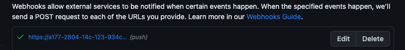
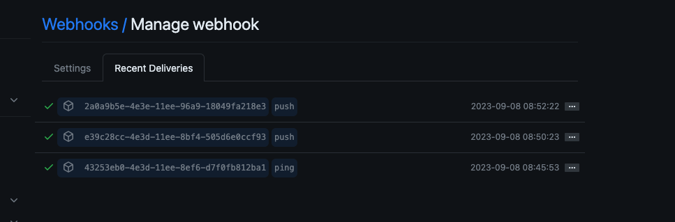
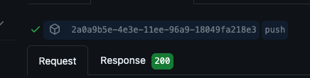

# notify-test

o objetivo desse repositorio é construir uma API na qual me permita ser noificado quando alguma alteração for realizada em um repositório do github

Para configurar o WebHook do github ou do Gitlab, preciso configurar um endpoint, caso esteja desenvolvendo o projeto localmente, podemos usar o
servidor ngrok, no qual funciona como um proxy reverso, um servidor web que gerencia outros servidores web.

Para instalar no macbook o ngrok, basta executar o comando:  
`brew install ngrok`

Uma vez instalado, execute sua aplicação, por exemplo fastapi executa na porta 8000 com uvicorn. 
Agora execute o ngrok na porta 8000, com o seguinte comando: 
`ngrok http 8000`

Para Configurar o WebHook do GitHub:

- acesse seu repositório
- Vá em configurações
- WebHook
- Adicionar WebHook
- Coloque o endpoint de sua API
- confirme a configuração

WebHook criado:  

Logo após a criação do webhook, o Github fará um ping para testar, clique em edit -> recent deliveries. Você irá ver o número de vezes que o hook enviou uma requisição para seu endpoint:  

Clicando em um deles, será possível ver o status code da requisição:  

